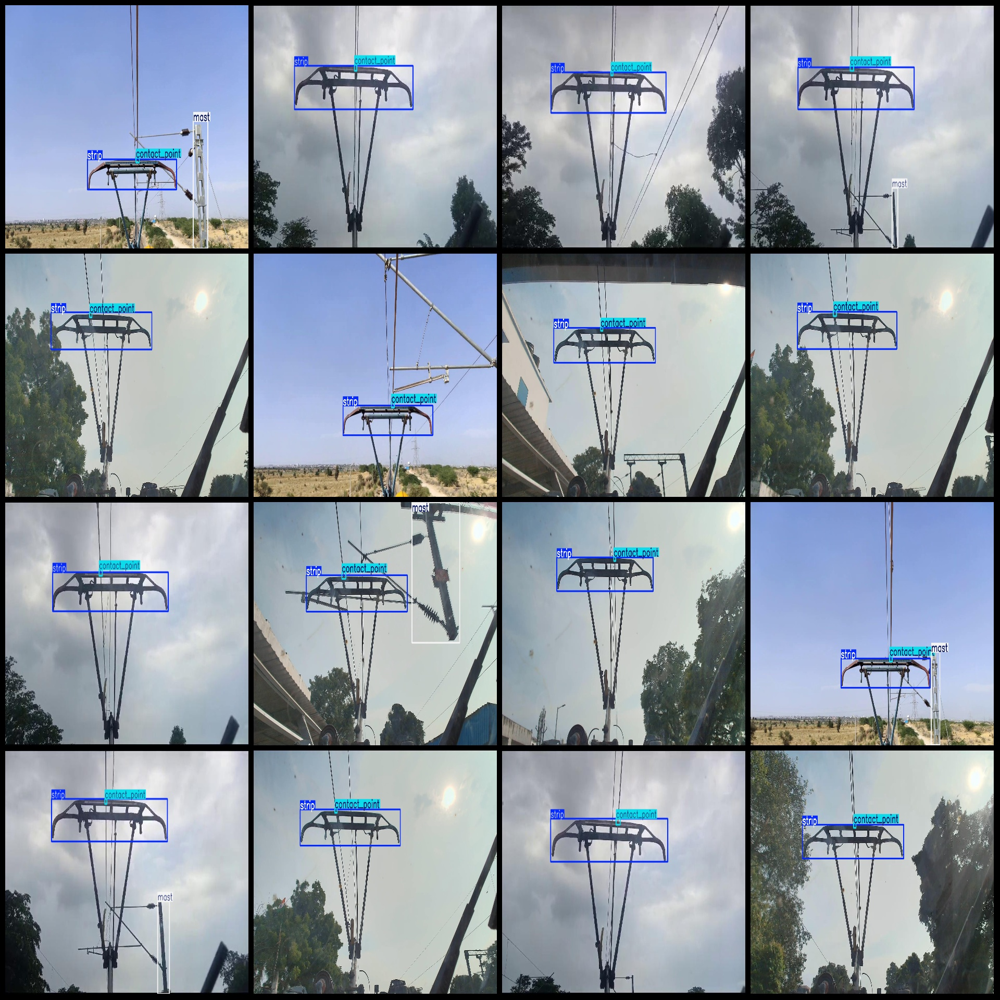
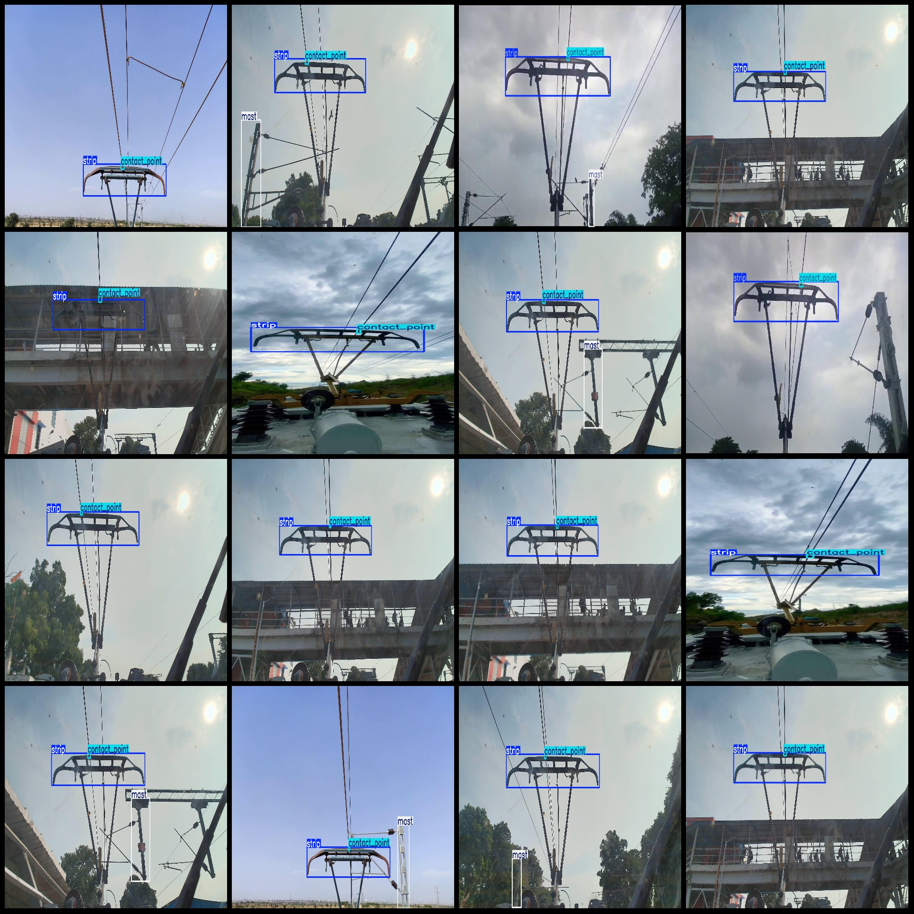

# Wisdom Railway High-Speed Train Grounding Point Support Bar Detection Dataset (VOC+YOLO format)

## Dataset Format: Pascal VOC format + YOLO format (txt file without split path, only containing jpg images and corresponding VOC format xml files and yolo format txt files)

### Image Count (Number of jpg files): 1836

### Annotated Count (Number of xml files): 1836

### Annotated Count (txt files): 1836

### Number of Annotated Categories: 3

Note: The order of categories in the yolo format does not match this, but is based on the labels folder 'classes.txt'.

Each category has an annotation count:
- Contact Point : 1841 frames
- Mast : 662 frames
- Strip : 1827 frames

Total number of frames: 4330

Image resolution: 1920x1080

Annotation tool used: labelImg

Annotation rules: Draw bounding boxes for each category

Important Notice: No guarantee is made regarding the accuracy of trained models or weight files.

Image Preview:

Annotated Example:
## Image

Here is a pay link on Stripe ( https://buy.stripe.com/3cs8yP7sY87d0vu9AB ). Please contact me lonlonago@foxmail.com after funding $89, and I will send you a complete data files , thank you!

